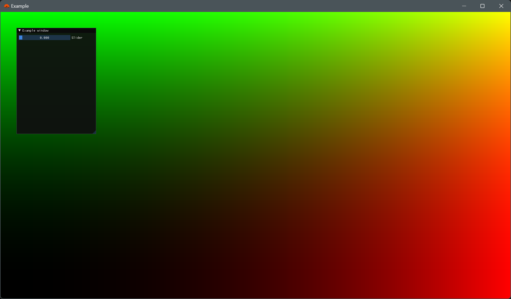

minigw
======

[](https://crates.io/crates/minigw)

[](https://docs.rs/minigw)

A convenient Rust library for creating cross platform windows and displaying pixel buffers. It also makes it easy to get keyboard and mouse input. There is full imgui rendering support build-in.



## Usage
Add this to your `Cargo.toml`:
```toml
[dependencies]
minigw = "0.0.1"
```
This example shows how to create a window and how to draw a gradient every frame.
```rust
extern crate minigw;

fn main() {
    minigw::new::<u8, _>("Example", 1280, 720,
        move |input, render_texture, imgui| {  
            let mut render_texture = render_texture.    as_mut();

            for x in 0..render_texture.width() {
                for y in 0..render_texture.height() {
                    let uv = (x as f32 /    render_texture.width() as f32, y   as f32 / render_texture.height()  as f32);
                    render_texture.set_pixel(x, y, &[(uv.0 * 255.99) as u8, (uv.1 * 255.99) as u8, 0]);
                }
            }
        });
}
```
## Input Handling & ImGui
Input can be handled by querying the state of the input struct. This example will toggle the cursor state between unlocked and locked every time the Space Bar has been pressed. Debug UI can be drawn by directly accessing the `imgui::Ui` struct.
```rust
extern crate minigw;
use minigw::imgui;

fn main() {
    minigw::new::<u8, _>("Example", 1280, 720,
        move |input, render_texture, imgui| {
            // ...

            let mut input_mut = input.as_mut();
            if input_mut.key_down           (minigw::VirtualKeyCode::Space) {
                input_mut.toggle_cursor_mode();
            }

            imgui.window("Example window")
                .size([400.0, 700.0],           imgui::Condition::FirstUseEver)
                .build(|| {
                    let mut x = 0.0;
                    imgui.slider("Slider", 0.0, 1.0, &mut x);
                });
        });
}
```

## Framebuffer type
The framebuffer type can be defined when creating a new window. `u8` works best for performance reasons but other supported types are: `i8`, `u16`, `i16`, `u32`, `i32` and `f32`. The same gradient example but now with an `f32` framebuffer can be seen below.
```rust
extern crate minigw;

fn main() {
    minigw::new::<f32, _>("Example", 1280, 720,
        move |input, render_texture, imgui| {  
            let mut render_texture = render_texture.    as_mut();

            for x in 0..render_texture.width() {
                for y in 0..render_texture.height() {
                    let uv = (x as f32 /    render_texture.width() as f32, y   as f32 / render_texture.height()  as f32);
                    render_texture.set_pixel(x, y, &[uv.0, uv.1, 0]);
                }
            }
        });
}
```

## License

This project is licensed under the MIT license ([LICENSE-MIT](LICENSE-MIT) or https://opensource.org/licenses/MIT).